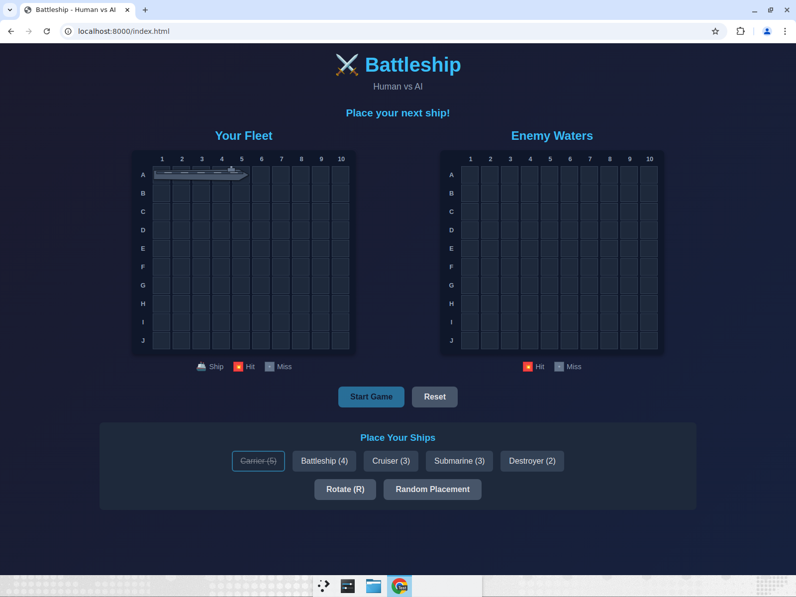
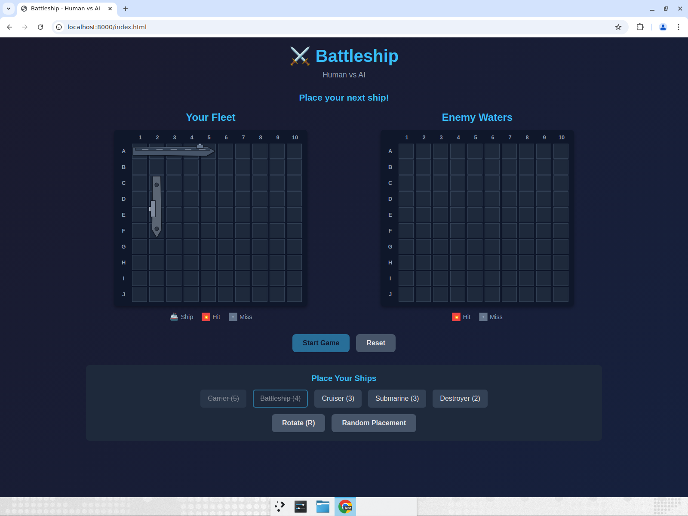
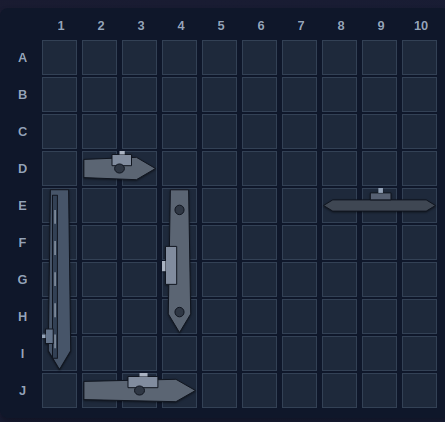
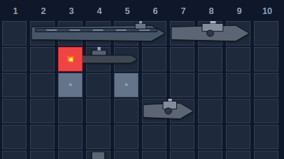

# Battleship — Ship Graphics: Test Report

**Change:** Replaced the plain green ship blocks with scalable SVG ship silhouettes drawn on an overlay above each board.

**Result:** All checks passed. No console errors.

## What changed
- `game.js`: added `buildShipSVG()` (per-type silhouettes, orientation-aware) and `renderShipOverlays()`; `renderBoard()` now draws ship overlays; enemy fleet revealed on game over; overlays realign on window resize.
- `styles.css`: ship cells now look like water (the silhouette sits on top), overlay/sprite layering, sunk-ship tint, hit/miss markers raised above ships.
- `index.html`: legend "Ship" swatch is now a 🚢 icon (green block no longer represents ships).
- `README.md`: corrected ship count (5) and documented the new graphics.

## Evidence

### Manual placement — Carrier renders horizontally as a ship

### Rotate + place — Battleship renders vertically

### Random placement — full fleet as distinct silhouettes

### Battle — 💥 hit marker stays on top of the ship hull

### Enemy board — hits (💥) vs misses (•); enemy ships stay hidden

